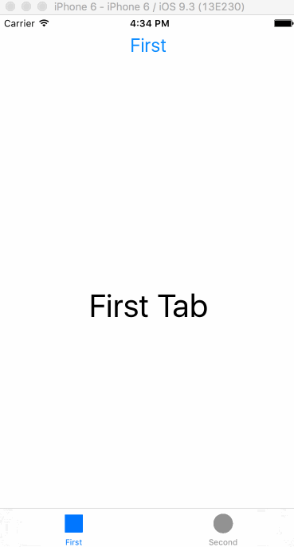
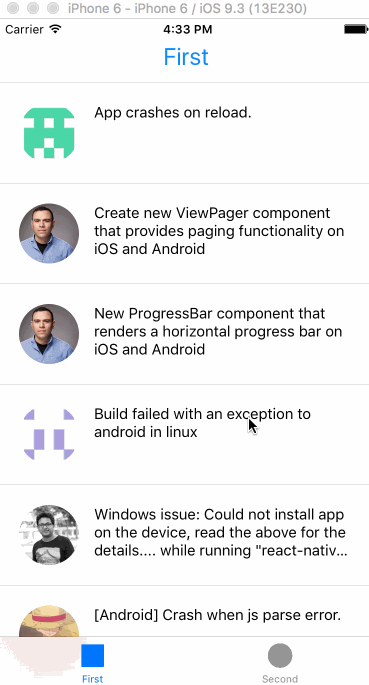

# tabbed-application

_This is part of the Facebook React Native Tel-Aviv Hackathon._

This is a tabbed application starter sample for React Native.

<h3 align="center">
  
  
</h3>
 
 

## Components

The structure is as simple as we could make it.

### App

The App wraps a tabbed layout using vanilla react components

### Tabs

Plain Vanilla TabBarIOS with base64 png icons

### Github API Sample

Instead of the plain and empty FirstTab and SecondTab components, we added a github sample
component that is found in the github folder together with an api.
It fetches github issues from the react native repo by an issue status provided to it as a prop.
to test it out, uncomment its import and component use statements under the tabs.
